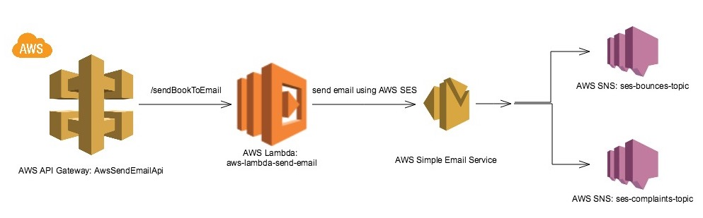

# AWS Lambda - Send emails with AWS SES

This repository contains module for sending emails with book details using AWS SES.

In order to launch this project, you need to have AWS Simple Email Service SMTP credentails:
 - sign-in into AWS web console
 - select service "Simple Email Service"
 - open SMTP Settings
 - click on button "Create My SMTP Credentials"

After that you will receive SMTP Username and SMTP Password, and you need to update in
[config file](src/main/resources/config/config.properties) two properties: `aws.ses.username` and `aws.ses.password` 
(put SMTP Username and SMTP Password instead of stars). Also update `app.fromEmailAddress` property with your verified email.
 
Now you are ready to run project locally: [EmailSenderRunner class](src/main/java/com/sarzhv/lambda/sendemail/EmailSenderRunner.java).

In order to run project with AWS Lambda, you need to run [EmailSenderLambdaRequestHandler class](src/main/java/com/sarzhv/lambda/sendemail/EmailSenderLambdaRequestHandler.java)

  

## AWS architecture

Project has the following architecture:

